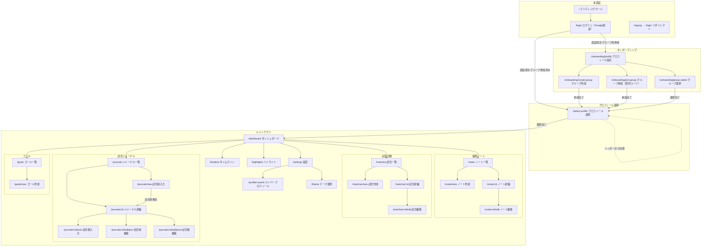

# FamNote 画面遷移図

最終更新: 2026-04-29

## 全体遷移図

## 認証ガード条件

| 条件 | リダイレクト先 |
|------|-------------|
| 未認証 | `/login` |
| 認証済み・グループ未参加 | `/onboarding/profile` |
| 認証済み・グループ参加済み・プロフィール未選択 | `/select-profile` |
| 認証済み・グループ参加済み・プロフィール選択済み | アクセス許可 |

## ボトムナビゲーション

| タブ | パス |
|-----|------|
| ホーム | `/dashboard` |
| ノート | `/notes` |
| 試合 | `/matches` |
| ジャーナル | `/journals` |
| 設定 | `/settings` |
